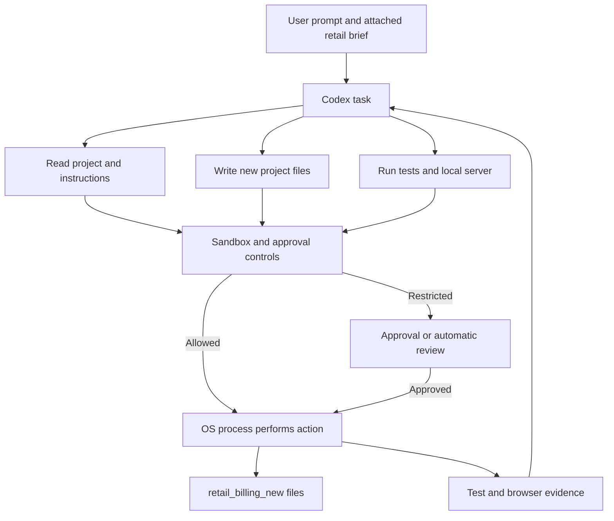

# Conversation handoff for future coders

This document captures the complete project-relevant, user-visible conversation through 2026-09-15. It preserves requests, answers, actions, decisions, corrections, and unresolved items. It is not a verbatim transcript or a record of private agent reasoning. For the original full brief, read the user-supplied `pasted-text.txt` attachment in this Codex task; for measured results and gaps, read [evidence-report.md](evidence-report.md).

## User intent and sequence

1. The user supplied a principal-architect/Python-developer brief and asked to **create the project in a new folder**. The brief calls for a retail billing UI, validating/calculating API, persistent invoice and line storage, reusable handling of different products, behavior-level tests, and a required evidence report separating requirement, implementation, and outcome gaps.
2. Codex created `retail_billing_new` beside the pre-existing `billinvoice` and `retail_billing_old` folders. Those older folders were inspected as references, not changed or adopted as authoritative retail requirements. The new project uses a standard-library HTTP server and SQLite, with free-text product lines and server-owned totals.
3. The user said **“live it.”** Codex started the app on `127.0.0.1:8000`, observed an HTTP 200 for the page, and opened the invoice form in the local browser. That was a local session, not a public deployment; a future coder should check whether the process is still running before relying on the URL.
4. The user asked whether `evidence-report.md` is the Codex agent’s “thinking.” Codex clarified that it records decisions, checks, observations, and gaps, not private reasoning.
5. The user asked whether the process guarantees no missed business outcome or expectation, and whether the project is “70 to 80% accurate.” Codex answered **no guarantee and no defensible percentage**. Passing tests cover specified cases; a fuller retail outcome requires decisions and validation with the intended user.
6. The user raised that an initial prompt had been in Plan mode while implementation had occurred. Codex explained that it had acted on the explicit creation request while the task was in Default mode. Later, the task was switched to Plan mode and then back to Default mode. These mode exchanges did not change code. The current task mode should be read from the active Codex instructions, not inferred from this historical note.
7. The user confirmed that Codex had implemented based on the prompt, then requested this Markdown reference for another coder.

## Subsequent conversation: code comparison and bugs

8. The user asked for a detailed comparison between `retail_billing_new` and `retail_billing_old`, which had better quality and fewer bugs, and whether one had “1+” or “5 bugs.” Codex inspected the diffs and ran both test suites. The old suite passed 3 tests; the new suite passed 5 tests.
9. Codex reported that `retail_billing_new` is the stronger starting point because it adds stored USD currency, invoice-number lookup, tax precision validation, an invoice size bound, `Cache-Control: no-store`, JSON content-type validation, controlled SQLite `503` responses, and tests for rounding and rollback.
10. Codex did **not** claim a proven total bug count. Five findings had been discussed across both versions, not five confirmed bugs in one version:
    - Repeated identical submissions create separate invoices in both versions. This was reproduced with IDs 1 and 2; its status is a known unresolved idempotency business rule.
    - The old UI cannot retrieve an invoice outside the latest-50 list by number; the new UI adds that lookup.
    - The old API does not provide a controlled response for SQLite failures; the new API returns `503`.
    - Pointing the new application at an existing old-schema database fails because `init_db()` does not migrate the missing `currency` column. This was reproduced as `OperationalError: table invoices has no column named currency`. Fresh new databases work.
    - Print output remains unverified in both versions; the presence and appearance of the print button are not proof of an accepted printed invoice.
11. When the user requested a domain-specific bug count for `retail_billing_new`, Codex summarized **two identified issues**: duplicate submission in ordinary fresh-install use and old-database compatibility when migration is expected. Only the latter is an implementation defect if reuse of the old database is in scope; duplicate handling remains an undecided business rule. The five passing tests do not establish that only one or two bugs exist.

## Subsequent conversation: sandbox, process, and tools

12. The user asked how Codex “thinking” relates to the sandbox. Codex explained that the sandbox constrains tool and command access to files, processes, and networks; it is not storage for model reasoning. `evidence-report.md` is deliberately written project evidence rather than private reasoning.
13. At the user’s request, Codex described the first-prompt workflow with diagrams: prompt and attachment → Codex task → read/write/command tools → sandbox check → OS process → project files and test output → browser verification. Workspace writes were allowed; local HTTP binding required approval in this session.
14. Codex distinguished the components:
    - The **Codex task** interprets the request, selects tool calls, and processes returned evidence.
    - **Tools** perform filesystem reads/writes, shell commands, and browser interaction subject to applicable controls.
    - The **sandbox** determines whether a tool action can access a path or network target; it does not determine whether retail rules are correct.
    - `python3 app.py` is an **OS process**. Its `ThreadingHTTPServer` creates application threads to handle requests; those are not Codex reasoning threads.
    - Tests and the evidence lifecycle assess behavior after the sandbox permits execution.

## Subsequent conversation: agents and access

15. The user asked how many “profiles” exist. Codex initially answered zero after looking only inside `retail_billing_new`. The user correctly asked for a recheck because a bug-finder profile had been created. Codex then found the workspace-level `.codex/agents/bug_finder.toml` and corrected the answer: **one custom Codex agent profile exists**.
16. The `bug_finder` agent is investigation-only. It uses `sandbox_mode = "read-only"`, searches for reproducible correctness, security, and reliability bugs, reports evidence and impact, and must not implement fixes. The main Codex task is a general agent and can investigate or implement within its active instructions and sandbox.
17. The user asked for production restrictions where some areas cannot even be read, some are read-only, and others are writable. Codex inspected official Codex permission-profile capabilities and explained that `AGENTS.md` behavior instructions are not filesystem enforcement. Named permission profiles can assign `deny`, `read`, or `write` to exact paths or workspace-relative subtrees.
18. Codex asked the user to classify exact production paths into three groups: no access, read-only, and read/write, including production database, secrets, configuration, and logs. The user chose to specify exact paths but has **not yet supplied the list**. Therefore, no production permission profile was created or activated.
19. The current observed access summary is:

| Agent | Current access | Enforcement |
| --- | --- | --- |
| Main Codex task | Reads and writes allowed by its active session permission profile | Session sandbox and approval policy |
| `bug_finder` | Read-only command sandbox; no file changes | `.codex/agents/bug_finder.toml` sets `sandbox_mode = "read-only"` |

Read-only does not automatically hide sensitive files. A future production profile must explicitly deny their paths. Project `AGENTS.md` defines engineering behavior and invariants, while a Codex permission profile provides filesystem enforcement.

## Corrections recorded

- The earlier statement that there were zero Codex profiles was incorrect because the search omitted the workspace-level `.codex` directory. The corrected count is one custom profile: `bug_finder`.
- References to “five bugs” were clarified: five review findings were discussed across two codebases, but no exact whole-project bug count was proven.
- The app was “live” only on local loopback during the observed session. It was never published or deployed publicly.

## Delivered first-version behavior

- A local cashier enters a customer, invoice-level tax rate, and one or more product names, quantities, and prices in `index.html`.
- `app.py` validates data, calculates rounded cent totals, commits header and lines atomically to SQLite, and provides create/list/get JSON endpoints. Saved line details are snapshots; browser-provided totals are not authoritative.
- A saved bill can be retrieved by invoice number or recent list. A print button is present, but printed output has not been inspected against an agreed format.
- `tests/test_app.py` covers two-product calculation and persistence, rejection without a saved invoice, rounding, HTTP create/list/get/error behavior, and rollback when a line insert fails.
- `README.md` gives run, API, and test commands. [evidence-report.md](evidence-report.md) is the detailed acceptance-to-evidence record.

## Decisions still owned by the user

The first version **assumes USD**, a manually entered invoice-level tax percentage, local sequential database IDs as invoice numbers, free-text product and price entry, and a single local user/store. These are not approved tax, currency, or legal-invoice policies. Discounts, returns, corrections/cancellation, payments, product catalog, multi-user access, and duplicate-submission handling are deferred. Ask about the relevant business rule before changing stored invoice meaning or claiming full retail readiness.

## Verified results and limits

The final recorded test run on 2026-09-14 used Python 3.14.4 and exited 0 with five tests passing. A browser exercise saved Notebook ×2 at $4.50 and Coffee beans ×0.5 at $12.00 with 8.25% tax, displaying a $15.00 subtotal, $1.24 tax, and $16.24 total. After a page reload, invoice #1 was retrieved with the same lines and amounts; a SQLite query matched the displayed values. A forced line-insert failure left no invoice header or lines in its test database. These checks establish the demonstrated local first-version path, not a percentage of overall business correctness. Printed output, production operations, and role-specific retail acceptance remain unverified.

## Guidance for the next coding task

Inspect the current worktree and [evidence-report.md](evidence-report.md) before editing. Preserve the separation of **requirement gaps** (unanswered rules), **implementation gaps** (agreed behavior not built), and **outcome gaps** (built behavior not demonstrated). Tie any new acceptance criterion to an actual check and update the evidence report after validation. Do not treat the historical local server session as a deployment or claim a numerical accuracy estimate without a defined baseline and measurement.
