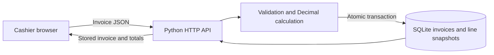
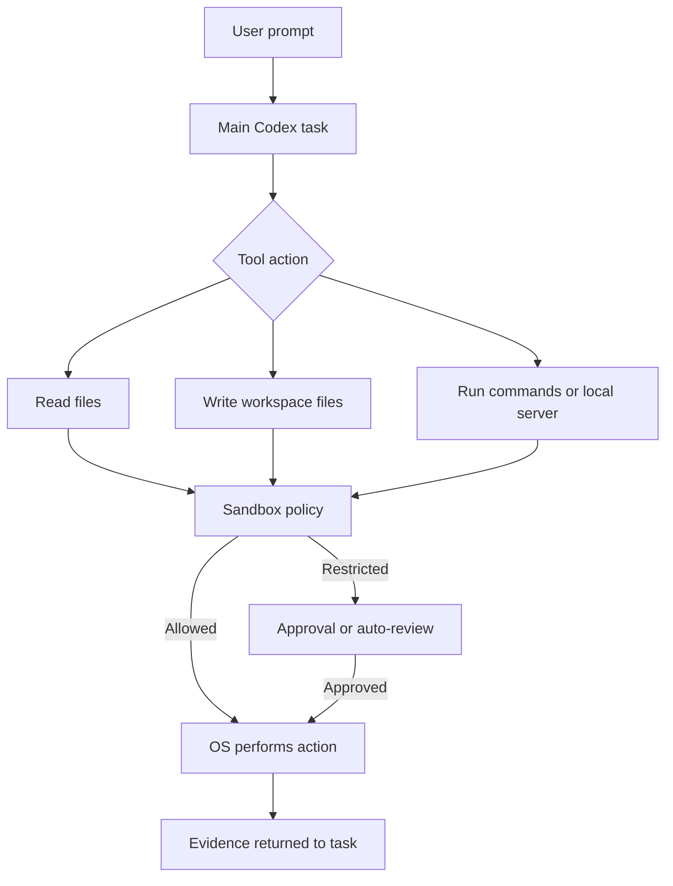

# Detailed conversation and project report

**Project:** `retail_billing_new`  
**Conversation coverage:** Project-relevant user-visible messages through 2026-09-15  
**Audience:** Developers, reviewers, architects, and future Codex tasks

This document preserves every user request and clarification visible in the project conversation, in chronological order. Spelling is retained where practical. It records the corresponding response or action and its evidence. It does not expose or reconstruct private model reasoning. System, developer, tool, approval, and environment-control messages are excluded because they are not user prompts.

## 1. Complete user-prompt chronology

### Prompt 1 — Create the project


Role and authority

Act as my principal software architect and hands-on Python developer. Demonstrate architectural judgment through clear decisions, working code, and verifiable results. I retain decision authority over material business rules, scope, and irreversible choices.

Domain and goal

Create a new Python project for retail billing software. A retail user must be able to create an invoice containing different products, submit it, and retrieve the saved invoice later.

The project must include:
1. A UI for entering and submitting billing data.
2. A backend API that validates data, calculates the invoice, and stores it.
3. A database that persists invoices and their product lines.
4. A reusable approach to billing different products.

Work with three distinct checks throughout: requirement gap, implementation gap, and outcome gap. Do not treat working code, passing tests, or the presence of a UI, API, and database as proof that the retail outcome has been achieved. Separate observed facts, assumptions, decisions, implemented behavior, and verified results.

Requirement gap — establish what to build

Before substantial implementation, inspect the workspace, repository instructions, and any existing product, application, screenshots, specifications, sample invoices, data models, code, or tests I provide. If a reference product exists, describe the relevant workflow and terminology you observed, with specific references. State what should be preserved, changed, or reused. If no reference is available, say so. Do not invent one.

Describe the intended retail workflow in enough detail for me to assess it: who creates an invoice; how products are selected or entered; where product names and prices come from; how quantities, discounts, and tax apply; when an invoice becomes final; and how a saved invoice is retrieved, printed, corrected, or cancelled. Identify the business rules that must remain true across the UI, API, and database.

Clarify whether “reusable across different products” requires a persistent product catalog, reusable invoice-line logic, or both. Consider currency, invoice numbering, tax jurisdiction, rounding, price overrides, customer information, returns, and whether multiple users or stores are in scope.

Create a short decision table for material unknowns. Classify each as:
- Must decide before finalizing the design.
- Safe default for the first version, with the assumption stated.
- Deferred from the first version.

Explain how changing each material decision later would affect stored invoices or the retail workflow. Ask me focused questions only when a decision materially changes the business result and cannot reasonably be inferred. Continue authorized, reversible inspection and implementation work while awaiting an answer. Do not silently treat assumptions as agreed requirements.

Before substantial coding, state the first-version scope, exclusions, and observable acceptance criteria. Include a complete multi-product invoice, retrieval of a saved invoice, an invalid submission that stores nothing, and relevant calculation edge cases.

Implementation gap — build the agreed behavior

Choose the simplest sufficient Python architecture and briefly explain its tradeoffs. Define ownership of product data, invoice snapshots, monetary calculations, and persistence. Keep the UI, API, and database contracts aligned.

The backend must validate input and calculate authoritative totals. Do not trust totals supplied by the browser. Use appropriate monetary precision and explicit rounding rules. Save the invoice and all product lines atomically so a failed submission cannot leave a partial bill. Preserve enough product, price, quantity, discount, and tax information to understand a historical invoice after catalog data changes.

Implement the new project with its UI, API, database schema, setup instructions, and meaningful behavior-level tests. Trace the complete path from user input through validation, calculation, database commit, API response, and user-visible invoice. Handle relevant failures and show useful feedback to the retail user. Follow existing repository conventions, preserve unrelated work, and avoid dependencies or infrastructure that lack a concrete requirement.

Compare every acceptance criterion with the implemented code. Identify agreed behavior that is missing, partial, or still dependent on an unresolved business decision. Do not describe a generic invoice prototype as complete retail billing software.

Outcome gap — verify the retail result

Verify the system from the intended retail user’s perspective. Exercise the complete flow: enter different products in the UI, submit an invoice, inspect the displayed bill, retrieve it in a fresh request or after restarting the application, and compare the retrieved amounts and product lines with the stored record. Inspect the rendered UI and printable invoice if printing is in scope.

Test meaningful failure and calculation cases based on the agreed rules. These may include invalid quantity or price, rounding, tax, changed product data, duplicate submission, and failed persistence. Select tests because they detect user-visible or data-integrity failures, not because they merely mirror the implementation.

For every acceptance criterion, record the check performed, its actual observed result, and whether it is verified, failed, or unverified. Distinguish automated tests, manual browser checks, database inspection, and assumptions. If a check cannot run, explain the limitation and mark that outcome unverified. A planned check, successful edit, or passing unit test is not evidence of an untested end-to-end outcome.

Evidence report — required deliverable

Create an evidence report in the new project, such as docs/evidence-report.md. Start it before implementation and update it after coding and verification. Link to it in the final response. Do not fill evidence gaps with guesses.

For each material requirement, record its source: this prompt, a supplied reference product or document, existing repository behavior, my answer to a question, or a clearly labeled assumption. Cite a specific file, example, or instruction where possible. Use stable requirement IDs that can be traced from scope through code and verification.

Include this traceability table:

| ID | Retail requirement and source | Acceptance criterion | Implementation reference | Verification check | Observed evidence | Status | Remaining gap |
| --- | --- | --- | --- | --- | --- | --- | --- |

Maintain three separate gap registers:

1. Requirement gaps
For every ambiguous, missing, or conflicting retail rule, record the evidence that revealed it, why it matters, the decision needed, the decision owner, any temporary assumption, and its status: open, answered, or deferred. Do not label an unanswered business rule as an implementation defect.

2. Implementation gaps
For every agreed criterion that is missing, partial, or contradicted by the code, cite the criterion and relevant implementation, describe the user-visible effect, state the next concrete change, and mark its status: open, fixed, or deferred. Do not present an unagreed feature as an implementation defect without identifying the assumption.

3. Outcome gaps
For every implemented behavior whose retail result has not been demonstrated, state the expected user outcome, the exact check needed, what was actually observed, why the current evidence is insufficient, and its status: unverified, failed, or verified. Do not mark a cashier workflow verified solely because a unit test or API test passed.

Record actual test commands, exit codes, relevant output, environment, and the code version or working state checked. If code changes after verification, rerun affected checks or mark the earlier evidence stale. Distinguish self-review from independent review.

Finish the evidence report with a readiness statement that says what a retail user can do now, what is blocked by a business decision, what is unimplemented, and what is unverified. This statement must agree with the traceability table and gap registers.

Delivery

Provide a runnable new project, exact setup and test commands, clickable file paths, and a concise explanation of important architectural decisions. Lead with what was actually delivered and verified.

End your final response with a brief three-part assessment:
1. Requirement gaps — unanswered business questions or assumptions.
2. Implementation gaps — agreed behavior not yet built.
3. Outcome gaps — built behavior not yet verified in the intended retail workflow.

Do not claim deployment, production readiness, regulatory compliance, or complete retail coverage unless explicitly required and supported by evidence. Continue through authorized implementation and appropriate verification without routine approval pauses. Return a decision to me only when it materially requires my authority.


> **Files pasted by the user:** `pasted-text.txt`  
> **My request:** create this project in to new folder

The attachment assigned Codex the role of principal software architect and hands-on Python developer and specified a retail billing application. Its complete contents are reproduced in Appendix A.

**Codex action:** Inspected the attachment, workspace, the existing `billinvoice` and `retail_billing_old` folders, and the applicable development workflow. Created `retail_billing_new` with a browser UI, Python JSON API, SQLite schema, tests, README, and evidence report.

**Result:** Five final tests passed. A browser and database exercise verified creation and retrieval of a two-product invoice. See [evidence-report.md](evidence-report.md).

### Prompt 2 — Run it locally

> live it

**Codex action:** Started `python3 app.py`, checked that `GET http://127.0.0.1:8000/` returned HTTP 200, and opened the local page in the in-app browser.

**Clarification:** This was local loopback availability on the user’s computer, not public hosting or production deployment.

### Prompt 3 — Meaning of the evidence report

> Now i have codex agnet thinking because we have evidence-report.md

**Codex response:** Explained that `evidence-report.md` records decisions, checks, observations, and gaps. It is not a record of Codex’s private thinking. It gives future tasks durable, reviewable project context.

### Prompt 4 — Whether the process prevents missed outcomes

> with the above process any business ouctoem or business expecattoion we will not miss as prompt and the evidence or ket life cyle followed for role specific

**Codex response:** Explained that the process reduces the chance of missing expectations but cannot guarantee full coverage. Every role-specific result must be defined with its owner and demonstrated in the real workflow; passing tests establish only the cases exercised.

### Prompt 5 — Accuracy expectation

> the functionality of the project would be 70 to 80% accurate ? normall do u think codex agnet does it correct ?

**Codex response:** Declined to assign an unsupported 70–80% accuracy number. Confirmed the tested first-version path while identifying undecided or unimplemented retail areas such as tax rules, discounts, returns, corrections, payments, and multi-user operation.

### Prompt 6 — Plan-mode concern

> my first prompt was plan mode but implemntation done by codex

**Codex response:** Acknowledged the concern. Explained that the explicit request to create the project had been treated as implementation authorization while the active task was in Default mode. Stated that the code remained isolated and uncommitted.

### Prompt 7 — User enabled Plan mode

> i have made plan mode on

**Codex response:** Confirmed that the task was then in Plan mode and explained that inspection and planning were allowed while file edits were not. The already-created project was not undone.

### Prompt 8 — Can code now be written?

> now u can write code correct ?

**Codex response:** At that moment, answered no because Plan mode was still active and requested a switch to Default mode before implementation.

### Prompt 9 — Implementation confirmation

> based on prompt codex have done implenemattion

**Codex response:** Confirmed that the original request had resulted in implementation under `retail_billing_new`, including UI, API, SQLite, tests, and evidence documentation. The active environment had returned to Default mode.

### Prompt 10 — Save conversation for other coders

> save this conversation of this chat to make it refernce for other coder in new md file

**Codex action:** Created [conversation-handoff.md](conversation-handoff.md) with project decisions, delivered behavior, verification, and unresolved questions.

### Prompt 11 — Compare old and new projects

> retail\_billing\_new vs  retail\_billing\_old code base in detailed diffeence and which code base has great code quality and less code bugs , which code 1+ 5 bugs

**Codex action:** Compared backend, UI, and tests and ran both test suites. Old passed 3 tests; new passed 5 tests.

**Response:** Recommended `retail_billing_new`. Reported improvements: currency snapshot, invoice-number lookup, tax precision validation, invoice size bound, no-store JSON responses, content-type checking, controlled persistence failures, and broader tests. Listed five cross-project findings without claiming five confirmed bugs in either project.

### Prompt 12 — Clarify “1+ 5 bugs”

> which code 1+ 5 bugs

**Codex response:** Clarified that neither codebase had a verified “1 bug” or “5 bugs” total. The five items were findings across both projects.

### Prompt 13 — Domain-specific bug count

> `retail_billing_new` role - principal archietct and domain specifc retails no of code bugs in this project

**Codex action:** Reviewed `retail_billing_new` against the agreed first-version scope.

**Response:** Reported two identified issues/risks: repeated submission creates another invoice, and old-schema databases lack the new `currency` column. Explained that duplicate behavior is still an unresolved business policy and that old-database failure is a compatibility defect only when old-database reuse is required. Did not claim this was the complete bug count.

### Prompt 14 — Codex thinking and sandbox

> codex ai thinking in process of sandbox

**Codex response:** Explained that the sandbox controls tool and command access to files and networks. The model’s reasoning is not stored “inside” the sandbox, and the evidence report is not a reasoning dump.

### Prompt 15 — Diagram of first-prompt sandbox controls

> sandbox controls for the first prompt with diagram

**Codex response:** Provided a Mermaid flow showing prompt → Codex decision → read/write/command actions → sandbox or approval → project creation → tests and evidence.

### Prompt 16 — Diagram including OS thread and tools

> sandbox , os thread and tool how it worked for new porojct creation  for the first prompt with diagram

**Codex response:** Distinguished the Codex task, tools, sandbox, OS process, and application threads. Explained that `python3 app.py` was an OS process and `ThreadingHTTPServer` created request-handling threads. Those threads were unrelated to model reasoning.

### Prompt 17 — Profile count

> no of profiles exist in this project ?

**Initial Codex response:** Incorrectly reported zero configured user profiles and zero Codex configuration profiles after searching only within `retail_billing_new`.

### Prompt 18 — Recheck bug-finder profile

> just recheck we created bug finder profile

**Codex action:** Rechecked hidden workspace configuration and found `.codex/agents/bug_finder.toml`.

**Corrected response:** Confirmed **one custom Codex agent profile**, `bug_finder`. The initial zero-profile answer was explicitly corrected.

### Prompt 19 — Investigation or implementation agent

> are investigation agent or implementation agent ?

**Codex response:** Explained that the main Codex task can investigate and implement when authorized. The custom `bug_finder` profile is investigation-only and configured not to modify code.

### Prompt 20 — Production access restrictions

> in production we want few things restricted to even read or write but few thing we want to read and write so we need agent with rules provide for this project

**Codex action:** Inspected `AGENTS.md`, `bug_finder.toml`, and official Codex permission-profile documentation. Explained that `AGENTS.md` instructions guide behavior but do not enforce filesystem boundaries. Proposed an enforceable permission profile using `deny`, `read`, and `write` rules.

**Question asked:** Requested exact paths for no access, read-only, and read/write, including production database, secrets, configuration, and logs.

### Prompt 21 — Path-selection reply

> I’ll specify exact paths

**Codex response/action:** Asked the user to provide those paths in three groups. No exact paths were subsequently supplied, so no production permission profile was written or activated.

### Prompt 22 — Request for current agent access

> provide me the agntes acess here in this project

**Codex response:** Reported current access:

- Main task: read/write according to the active session sandbox and approval policy.
- `bug_finder`: read-only sandbox, no file changes.

Clarified that read-only does not automatically hide sensitive data and that explicit deny rules are still needed.

### Prompt 23 — Update conversation handoff

> give me including all chat conversation conversation update to new md

**Codex action:** Expanded `conversation-handoff.md` to cover creation, modes, bug review, sandbox/OS/tool explanation, profile correction, current access, and the unresolved production permission profile.

### Prompt 24 — Create this detailed report

> we need every prompt provide here for all user to share all other coder give me detailed\_report.md

**Codex action:** Created this file, `docs/detailed_report.md`, with every user prompt available in the current conversation, corresponding responses/actions, the original attached brief, evidence, corrections, and next decisions.

## 2. Delivered project state

The new project contains:

| Path | Purpose |
| --- | --- |
| `app.py` | Standard-library HTTP API, validation, authoritative calculations, and SQLite persistence |
| `index.html` | Cashier form, invoice display, number lookup, recent list, and print action |
| `tests/test_app.py` | Calculation, validation, persistence, rollback, and HTTP behavior tests |
| `README.md` | Setup, run, API, rules, scope, and limitations |
| `docs/evidence-report.md` | Requirement-to-implementation-to-verification traceability and gap registers |
| `docs/conversation-handoff.md` | Concise chronological handoff |
| `AGENTS.md` | Durable project engineering rules and business invariants |
| `.agents/skills/retail-coding-standards/SKILL.md` | Project coding workflow for future code changes |
| Workspace `.codex/agents/bug_finder.toml` | Read-only custom bug-investigation agent |

## 3. Architecture and data flow



The server owns totals. Each line stores the product name, quantity, unit price, and calculated amount so historical invoices do not depend on later catalog changes. SQLite commits invoice header and product lines together.

## 4. Verification evidence

The final recorded test run used Python 3.14.4:

```sh
cd retail_billing_new
python3 -m unittest discover -s tests -v
```

Observed result: exit code 0, five tests, `OK`.

The browser verification created a bill containing Notebook ×2 at $4.50 and Coffee beans ×0.5 at $12.00 with 8.25% tax. The displayed and retrieved results were subtotal $15.00, tax $1.24, and total $16.24. A direct SQLite query matched these values. A forced line-insert failure left zero invoice headers and zero product lines in the test database.

The old/new comparison later reran both suites successfully: 3 old tests and 5 new tests.

## 5. Known findings and their classification

| Finding | Classification | Evidence/status |
| --- | --- | --- |
| Identical repeated POST creates another invoice | Requirement gap until duplicate/idempotency policy is decided | Reproduced as IDs 1 and 2 |
| New app cannot use old schema without migration | Conditional implementation defect when migration is required | Reproduced missing `currency` column error |
| Printed invoice not inspected against approved format | Outcome gap | Print button exists; print result unverified |
| Currency, tax jurisdiction, and legal numbering undecided | Requirement gaps | USD/manual tax/local ID are labeled assumptions |
| Discounts, returns, corrections, payments, catalog, authentication, and multi-store use absent | Deferred scope | Documented in README/evidence report |

There is no evidence-supported whole-project bug count or accuracy percentage.

## 6. Agent and sandbox state



The workspace currently has one custom agent profile: `bug_finder`. It uses `sandbox_mode = "read-only"` and must report reproducible bugs without applying fixes. The main agent follows the active session permission profile.

No production-specific permission profile exists yet. The user intends to provide exact paths for:

1. No read or write.
2. Read-only.
3. Read and write.

Until that list is supplied and encoded in a permission profile, sensitive production files are not protected by project-specific deny rules merely because `AGENTS.md` contains instructions.

## 7. Corrections and cautions for future coders

- The corrected number of custom Codex profiles is **one**, not zero.
- Five review findings across old and new projects are not five proven bugs in either project.
- The local app session was not a public deployment.
- `evidence-report.md` and this report contain observable facts, decisions, and summaries; neither contains private model reasoning.
- Treat `retail_billing_new/billing.sqlite3` as user data. Tests must use a temporary database.
- Read current code before relying on historical descriptions because all project folders are still uncommitted in the observed worktree.

## 8. Decisions required before production work

The user still needs to decide or provide:

- Exact denied, read-only, and writable paths for the production agent.
- Currency policy and whether multiple currencies are required.
- Tax jurisdiction and calculation rules.
- Legal invoice-numbering requirements.
- Duplicate-submission/idempotency behavior.
- Correction, cancellation, return, discount, and payment workflows.
- Authentication, authorization, user roles, store boundaries, backups, retention, and audit requirements.
- Accepted printed-invoice layout and required statutory fields.

## Appendix A — Complete original attached project brief

Role and authority

Act as my principal software architect and hands-on Python developer. Demonstrate architectural judgment through clear decisions, working code, and verifiable results. I retain decision authority over material business rules, scope, and irreversible choices.

Domain and goal

Create a new Python project for retail billing software. A retail user must be able to create an invoice containing different products, submit it, and retrieve the saved invoice later.

The project must include:
1. A UI for entering and submitting billing data.
2. A backend API that validates data, calculates the invoice, and stores it.
3. A database that persists invoices and their product lines.
4. A reusable approach to billing different products.

Work with three distinct checks throughout: requirement gap, implementation gap, and outcome gap. Do not treat working code, passing tests, or the presence of a UI, API, and database as proof that the retail outcome has been achieved. Separate observed facts, assumptions, decisions, implemented behavior, and verified results.

Requirement gap — establish what to build

Before substantial implementation, inspect the workspace, repository instructions, and any existing product, application, screenshots, specifications, sample invoices, data models, code, or tests I provide. If a reference product exists, describe the relevant workflow and terminology you observed, with specific references. State what should be preserved, changed, or reused. If no reference is available, say so. Do not invent one.

Describe the intended retail workflow in enough detail for me to assess it: who creates an invoice; how products are selected or entered; where product names and prices come from; how quantities, discounts, and tax apply; when an invoice becomes final; and how a saved invoice is retrieved, printed, corrected, or cancelled. Identify the business rules that must remain true across the UI, API, and database.

Clarify whether “reusable across different products” requires a persistent product catalog, reusable invoice-line logic, or both. Consider currency, invoice numbering, tax jurisdiction, rounding, price overrides, customer information, returns, and whether multiple users or stores are in scope.

Create a short decision table for material unknowns. Classify each as:
- Must decide before finalizing the design.
- Safe default for the first version, with the assumption stated.
- Deferred from the first version.

Explain how changing each material decision later would affect stored invoices or the retail workflow. Ask me focused questions only when a decision materially changes the business result and cannot reasonably be inferred. Continue authorized, reversible inspection and implementation work while awaiting an answer. Do not silently treat assumptions as agreed requirements.

Before substantial coding, state the first-version scope, exclusions, and observable acceptance criteria. Include a complete multi-product invoice, retrieval of a saved invoice, an invalid submission that stores nothing, and relevant calculation edge cases.

Implementation gap — build the agreed behavior

Choose the simplest sufficient Python architecture and briefly explain its tradeoffs. Define ownership of product data, invoice snapshots, monetary calculations, and persistence. Keep the UI, API, and database contracts aligned.

The backend must validate input and calculate authoritative totals. Do not trust totals supplied by the browser. Use appropriate monetary precision and explicit rounding rules. Save the invoice and all product lines atomically so a failed submission cannot leave a partial bill. Preserve enough product, price, quantity, discount, and tax information to understand a historical invoice after catalog data changes.

Implement the new project with its UI, API, database schema, setup instructions, and meaningful behavior-level tests. Trace the complete path from user input through validation, calculation, database commit, API response, and user-visible invoice. Handle relevant failures and show useful feedback to the retail user. Follow existing repository conventions, preserve unrelated work, and avoid dependencies or infrastructure that lack a concrete requirement.

Compare every acceptance criterion with the implemented code. Identify agreed behavior that is missing, partial, or still dependent on an unresolved business decision. Do not describe a generic invoice prototype as complete retail billing software.

Outcome gap — verify the retail result

Verify the system from the intended retail user’s perspective. Exercise the complete flow: enter different products in the UI, submit an invoice, inspect the displayed bill, retrieve it in a fresh request or after restarting the application, and compare the retrieved amounts and product lines with the stored record. Inspect the rendered UI and printable invoice if printing is in scope.

Test meaningful failure and calculation cases based on the agreed rules. These may include invalid quantity or price, rounding, tax, changed product data, duplicate submission, and failed persistence. Select tests because they detect user-visible or data-integrity failures, not because they merely mirror the implementation.

For every acceptance criterion, record the check performed, its actual observed result, and whether it is verified, failed, or unverified. Distinguish automated tests, manual browser checks, database inspection, and assumptions. If a check cannot run, explain the limitation and mark that outcome unverified. A planned check, successful edit, or passing unit test is not evidence of an untested end-to-end outcome.

Evidence report — required deliverable

Create an evidence report in the new project, such as docs/evidence-report.md. Start it before implementation and update it after coding and verification. Link to it in the final response. Do not fill evidence gaps with guesses.

For each material requirement, record its source: this prompt, a supplied reference product or document, existing repository behavior, my answer to a question, or a clearly labeled assumption. Cite a specific file, example, or instruction where possible. Use stable requirement IDs that can be traced from scope through code and verification.

Include this traceability table:

| ID | Retail requirement and source | Acceptance criterion | Implementation reference | Verification check | Observed evidence | Status | Remaining gap |
| --- | --- | --- | --- | --- | --- | --- | --- |

Maintain three separate gap registers:

1. Requirement gaps
For every ambiguous, missing, or conflicting retail rule, record the evidence that revealed it, why it matters, the decision needed, the decision owner, any temporary assumption, and its status: open, answered, or deferred. Do not label an unanswered business rule as an implementation defect.

2. Implementation gaps
For every agreed criterion that is missing, partial, or contradicted by the code, cite the criterion and relevant implementation, describe the user-visible effect, state the next concrete change, and mark its status: open, fixed, or deferred. Do not present an unagreed feature as an implementation defect without identifying the assumption.

3. Outcome gaps
For every implemented behavior whose retail result has not been demonstrated, state the expected user outcome, the exact check needed, what was actually observed, why the current evidence is insufficient, and its status: unverified, failed, or verified. Do not mark a cashier workflow verified solely because a unit test or API test passed.

Record actual test commands, exit codes, relevant output, environment, and the code version or working state checked. If code changes after verification, rerun affected checks or mark the earlier evidence stale. Distinguish self-review from independent review.

Finish the evidence report with a readiness statement that says what a retail user can do now, what is blocked by a business decision, what is unimplemented, and what is unverified. This statement must agree with the traceability table and gap registers.

Delivery

Provide a runnable new project, exact setup and test commands, clickable file paths, and a concise explanation of important architectural decisions. Lead with what was actually delivered and verified.

End your final response with a brief three-part assessment:
1. Requirement gaps — unanswered business questions or assumptions.
2. Implementation gaps — agreed behavior not yet built.
3. Outcome gaps — built behavior not yet verified in the intended retail workflow.

Do not claim deployment, production readiness, regulatory compliance, or complete retail coverage unless explicitly required and supported by evidence. Continue through authorized implementation and appropriate verification without routine approval pauses. Return a decision to me only when it materially requires my authority.
